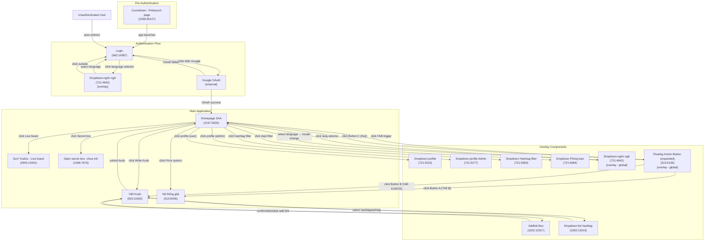

# Screen Flow Overview

## Project Info

- **Project Name**: Sun Annual Awards 2025 (SAA 2025)
- **Figma File Key**: `9ypp4enmFmdK3YAFJLIu6C`
- **Figma URL**: https://www.figma.com/design/9ypp4enmFmdK3YAFJLIu6C
- **Created**: 2026-03-10
- **Last Updated**: 2026-03-18

---

## Discovery Progress

| Metric        | Count |
| ------------- | ----- |
| Total Screens | 15    |
| Discovered    | 15    |
| Remaining     | 0     |
| Completion    | 100%  |

---

## Screens

| #   | Screen Name                    | Frame ID      | Figma Link                                                                                  | Status     | Detail File                                                                                     | Navigations To                                              |
| --- | ------------------------------ | ------------- | ------------------------------------------------------------------------------------------- | ---------- | ----------------------------------------------------------------------------------------------- | ----------------------------------------------------------- |
| 1   | Login                          | `662:14387`   | [Open](https://www.figma.com/design/9ypp4enmFmdK3YAFJLIu6C?node-id=662:14387)              | discovered | [spec.md](.momorph/specs/662:14387-Login/spec.md)                                               | Homepage SAA (post-auth), Language Dropdown overlay         |
| 2   | Countdown - Prelaunch page     | `2268:35127`  | [Open](https://www.figma.com/design/9ypp4enmFmdK3YAFJLIu6C?node-id=2268:35127)             | discovered | —                                                                                               | Login (on launch)                                           |
| 3   | Homepage SAA                   | `2167:9026`   | [Open](https://www.figma.com/design/9ypp4enmFmdK3YAFJLIu6C?node-id=2167:9026)              | discovered | —                                                                                               | Viết Kudo, Live board, Hệ thống giải, Open secret box, dropdowns |
| 4   | Viết Kudo                      | `520:11602`   | [Open](https://www.figma.com/design/9ypp4enmFmdK3YAFJLIu6C?node-id=520:11602)              | discovered | —                                                                                               | Addlink Box overlay, Dropdown list hashtag, Homepage SAA   |
| 5   | Sun* Kudos - Live board        | `2940:13431`  | [Open](https://www.figma.com/design/9ypp4enmFmdK3YAFJLIu6C?node-id=2940:13431)             | discovered | —                                                                                               | —                                                           |
| 6   | Hệ thống giải                  | `313:8436`    | [Open](https://www.figma.com/design/9ypp4enmFmdK3YAFJLIu6C?node-id=313:8436)               | discovered | —                                                                                               | —                                                           |
| 7   | Open secret box- chưa mở      | `1466:7676`   | [Open](https://www.figma.com/design/9ypp4enmFmdK3YAFJLIu6C?node-id=1466:7676)              | discovered | —                                                                                               | —                                                           |
| 8   | Addlink Box                    | `1002:12917`  | [Open](https://www.figma.com/design/9ypp4enmFmdK3YAFJLIu6C?node-id=1002:12917)             | discovered | —                                                                                               | Viết Kudo (dismiss/confirm)                                 |
| 9   | Dropdown-ngôn ngữ              | `721:4942`    | [Open](https://www.figma.com/design/9ypp4enmFmdK3YAFJLIu6C?node-id=721:4942)               | discovered | [spec.md](.momorph/specs/721:4942-Dropdown-ngôn ngữ/spec.md)                                   | Current screen (locale changed), dismiss                    |
| 10  | Dropdown-profile               | `721:5223`    | [Open](https://www.figma.com/design/9ypp4enmFmdK3YAFJLIu6C?node-id=721:5223)               | spec       | [spec.md](.momorph/specs/721:5223-Dropdown-profile/spec.md)                                     | Profile, Settings, Logout                                   |
| 11  | Dropdown-profile Admin         | `721:5277`    | [Open](https://www.figma.com/design/9ypp4enmFmdK3YAFJLIu6C?node-id=721:5277)               | discovered | —                                                                                               | Profile, Admin Settings, Logout                             |
| 12  | Dropdown Hashtag filter        | `721:5580`    | [Open](https://www.figma.com/design/9ypp4enmFmdK3YAFJLIu6C?node-id=721:5580)               | discovered | —                                                                                               | Homepage SAA (filtered)                                     |
| 13  | Dropdown Phòng ban             | `721:5684`    | [Open](https://www.figma.com/design/9ypp4enmFmdK3YAFJLIu6C?node-id=721:5684)               | discovered | —                                                                                               | Homepage SAA (filtered)                                     |
| 14  | Dropdown list hashtag          | `1002:13013`  | [Open](https://www.figma.com/design/9ypp4enmFmdK3YAFJLIu6C?node-id=1002:13013)             | discovered | —                                                                                               | Viết Kudo (hashtag selected)                                |
| 15  | Floating Action Button (expanded) | `313:9139` | [Open](https://www.figma.com/design/9ypp4enmFmdK3YAFJLIu6C?node-id=313:9139)               | spec       | [spec.md](.momorph/specs/313:9139-floating-action-button-phim-noi-chuc-nang-2/spec.md)         | Viết Kudo (Button B), Thể lệ UPDATE (Button A), collapse (Button C) |

---

## Navigation Graph

---

## Screen Groups

### Group: Pre-Authentication

| Screen                     | Purpose                              | Entry Points          |
| -------------------------- | ------------------------------------ | --------------------- |
| Countdown - Prelaunch page | Shown before app goes live           | Direct app access     |

### Group: Authentication

| Screen                           | Purpose                                                     | Entry Points                                                  |
| -------------------------------- | ----------------------------------------------------------- | ------------------------------------------------------------- |
| Login                            | Application entry point; Google OAuth authentication        | App launch (unauthenticated), Logout, Protected page redirect |
| Dropdown-ngôn ngữ (overlay)      | Language selection overlay accessible before authentication | Login screen language selector click                          |

### Group: Main Application

| Screen                    | Purpose                                            | Entry Points                                              |
| ------------------------- | -------------------------------------------------- | --------------------------------------------------------- |
| Homepage SAA              | Main post-authentication feed/hub                  | Successful Google OAuth callback, already-authenticated   |
| Viết Kudo                 | Kudo creation form                                 | Homepage "Write Kudo" button                              |
| Sun* Kudos - Live board   | Real-time live display of kudos feed               | Homepage, post-kudo submission                            |
| Hệ thống giải             | Prize system overview                              | Homepage navigation                                       |
| Open secret box- chưa mở | Secret box interaction (unopened state)            | Homepage                                                  |

### Group: Overlay Components (no standalone URL)

| Screen                    | Purpose                                     | Trigger                                       |
| ------------------------- | ------------------------------------------- | --------------------------------------------- |
| Dropdown-ngôn ngữ         | Language switcher (VN ↔ EN)                 | Language selector in header (all screens)     |
| Dropdown-profile          | User profile menu (regular role)            | Profile avatar click (regular user)           |
| Dropdown-profile Admin    | User profile menu (admin role)              | Profile avatar click (admin user)             |
| Dropdown Hashtag filter   | Filter homepage feed by hashtag             | Hashtag filter control on Homepage SAA        |
| Dropdown Phòng ban        | Filter homepage feed by department          | Department selector on Homepage SAA           |
| Dropdown list hashtag     | Searchable hashtag list for kudo creation   | Hashtag selector in Viết Kudo form            |
| Addlink Box               | Link attachment for kudo creation           | Add link button in Viết Kudo form             |
| Floating Action Button (expanded) | Quick-access overlay with Thể lệ, Viết KUDOS, and cancel actions | FAB trigger button click (any authenticated screen) |

---

## Dropdown Components

### Dropdown-ngôn ngữ (Language Selector) Detail

**Frame ID**: `721:4942`
**Status**: spec | **Spec doc**: `.momorph/specs/721:4942-Dropdown-ngôn ngữ/spec.md`

- **Purpose**: Allows the user to switch the application display language between Vietnamese and English.
- **Trigger**: Clicking the language selector element in the navigation header (accessible from all authenticated screens and the Login screen).
- **Behavior**:
  - Opens as a floating overlay anchored to the language icon/label in the header.
  - Lists two options: VN (Tiếng Việt) and EN (Tiếng Anh), each with country flag icon and language code.
  - Currently selected language is highlighted with `rgba(255, 234, 158, 0.20)` background.
  - Selecting a language changes the UI locale and closes the dropdown.
  - Dismissible by clicking outside the dropdown or pressing Escape.
- **Transitions**:
  - Open: 150ms ease-out fade + slide-down
  - Select language → locale routing update (Next.js i18n), dropdown closes
  - Click outside / Escape → dropdown closes, no change

### Dropdown-profile (User Profile Menu) Detail

**Frame ID**: `721:5223`
**Status**: spec | **Spec doc**: `.momorph/specs/721:5223-Dropdown-profile/spec.md`

- **Purpose**: Displays a profile menu overlay for regular (non-admin) users, providing quick access to profile, settings, and logout actions.
- **Trigger**: Clicking the profile avatar in the navigation header on any authenticated screen.
- **Behavior**:
  - Opens as a floating dropdown overlay anchored to the profile avatar in the header.
  - Displays user information (avatar, name, email/role) at the top.
  - Lists action items: Profile, Settings, and Logout.
  - Dismissible by clicking outside the dropdown or pressing Escape.
  - Only shown for regular user role (admin users see Dropdown-profile Admin instead).
- **Transitions**:
  - Open: fade + slide-down animation on appearance.
  - Select Profile → navigates to user profile page.
  - Select Settings → navigates to user settings page.
  - Select Logout → triggers logout action, redirects to Login screen.
  - Click outside / Escape → dropdown closes, no navigation.

---

## Interaction Summary

| User Action                    | Source Screen               | Target / Result                                        |
| ------------------------------ | --------------------------- | ------------------------------------------------------ |
| App not launched yet           | —                           | Countdown - Prelaunch page                             |
| App launches                   | Countdown - Prelaunch page  | Login                                                  |
| Successful Google OAuth login  | Login                       | Homepage SAA                                           |
| Failed / cancelled OAuth       | Login                       | Login (error state)                                    |
| Click language selector        | Login / any screen          | Dropdown-ngôn ngữ overlay                              |
| Select VN language             | Dropdown-ngôn ngữ           | Locale → `/vi/…`, dropdown closes                      |
| Select EN language             | Dropdown-ngôn ngữ           | Locale → `/en/…`, dropdown closes                      |
| Click outside / Escape         | Dropdown-ngôn ngữ           | Dropdown closes, locale unchanged                      |
| Click profile avatar (user)    | Any authenticated screen    | Dropdown-profile overlay                               |
| Click profile avatar (admin)   | Any authenticated screen    | Dropdown-profile Admin overlay                         |
| Click Write Kudo               | Homepage SAA                | Viết Kudo screen                                       |
| Click add link in Kudo form    | Viết Kudo                   | Addlink Box overlay                                    |
| Select hashtag in Kudo form    | Viết Kudo                   | Dropdown list hashtag overlay                          |
| Submit Kudo                    | Viết Kudo                   | Returns to Homepage SAA / Live board                   |
| Click Live board               | Homepage SAA                | Sun* Kudos - Live board                                |
| Click Prize system             | Homepage SAA                | Hệ thống giải                                          |
| Click Secret box               | Homepage SAA                | Open secret box- chưa mở                              |
| Filter by department           | Homepage SAA                | Dropdown Phòng ban overlay                             |
| Filter by hashtag              | Homepage SAA                | Dropdown Hashtag filter overlay                        |
| Click FAB trigger              | Any authenticated screen    | Floating Action Button overlay (expanded state)        |
| Click Thể lệ (FAB Button A)   | FAB expanded overlay        | Hệ thống giải / Thể lệ UPDATE screen                  |
| Click Viết KUDOS (FAB Button B) | FAB expanded overlay       | Viết Kudo screen                                       |
| Click Huỷ (FAB Button C)       | FAB expanded overlay        | FAB collapses, stays on current screen                 |

---

## API Endpoints Summary

| Endpoint                | Method | Screens Using                   | Purpose                                                             |
| ----------------------- | ------ | ------------------------------- | ------------------------------------------------------------------- |
| `/auth/google`          | GET    | Login                           | Initiate Google OAuth 2.0 flow; redirects to Google consent screen  |
| `/auth/google/callback` | GET    | Login (OAuth callback)          | Validate authorization code, create session, redirect to dashboard  |
| `/auth/session`         | GET    | Login (guard), Protected pages  | Check current authentication status / session validity              |
| `/auth/logout`          | POST   | Dashboard (future)              | Invalidate current session; redirect to Login                       |

---

## Technical Notes

### Authentication Flow

- Google OAuth 2.0 (server-side flow via Supabase `@supabase/ssr`)
- Session managed via secure HTTP-only cookies
- Unauthenticated users accessing any protected route are redirected to `/[locale]/login`
- Authenticated users visiting `/login` are immediately redirected to Homepage SAA

### Routing

- Router: Next.js App Router with locale-based routing
- Protected routes enforced via middleware (`src/middleware.ts`)
- Login path: `/[locale]/login`
- All navigation URLs must be derived from this document per constitution §III

### Localization

- Supported locales: `vi` (Vietnamese, default), `en` (English)
- Language switcher: `Dropdown-ngôn ngữ` (`721:4942`) — accessible from all screens
- Locale managed via Next.js i18n routing (`src/i18n/`, `src/middleware.ts`)
- Spec doc: `.momorph/specs/721:4942-Dropdown-ngôn ngữ/spec.md`
