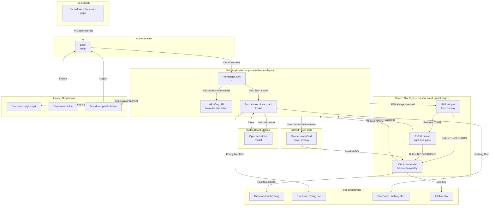

# Screen Flow Overview

## Project Info

- **Project Name**: Sun\* Annual Awards 2025 (SAA 2025)
- **Figma File Key**: `9ypp4enmFmdK3YAFJLIu6C`
- **Figma URL**: https://www.figma.com/design/9ypp4enmFmdK3YAFJLIu6C
- **Created**: 2026-03-18
- **Last Updated**: 2026-03-19

---

## Discovery Progress

| Metric        | Count |
| ------------- | ----- |
| Total Screens | 17    |
| Discovered    | 17    |
| Remaining     | 0     |
| Completion    | 100%  |

---

## Screens

| #   | Screen Name                | Frame ID     | Route / Trigger                           | Status     | Spec File                                                                     | Navigations To                                         |
| --- | -------------------------- | ------------ | ----------------------------------------- | ---------- | ----------------------------------------------------------------------------- | ------------------------------------------------------ |
| 1   | Countdown - Prelaunch page | `2268:35127` | `/` (pre-launch)                          | discovered | `.momorph/specs/2268:35127-Countdown - Prelaunch page/spec.md`                | Login (auto-redirect at T=0)                           |
| 2   | Login                      | `662:14387`  | `/login`                                  | discovered | `.momorph/specs/662:14387-Login/spec.md`                                      | Homepage SAA (after OAuth success)                     |
| 3   | Homepage SAA               | `2167:9026`  | `/` (post-login)                          | discovered | `.momorph/specs/2167:9026-Homepage SAA/spec.md`                               | Hệ thống giải, Sun\* Kudos - Live board, FAB Widget    |
| 4   | Hệ thống giải              | `313:8436`   | `/awards-information`                     | discovered | `.momorph/specs/313:8436-Hệ thống giải/spec.md`                               | Homepage SAA (nav), FAB Widget                         |
| 5   | Sun\* Kudos - Live board   | `2940:13431` | `/kudos`                                  | discovered | `.momorph/specs/2940:13431-Sun* Kudos - Live board/spec.md`                   | Viết Kudo (modal), Open secret box (modal), FAB Widget |
| 6   | Viết Kudo (modal)          | `520:11602`  | Overlay on any (main) page                | discovered | `.momorph/specs/520:11602-Viết Kudo/spec.md`                                  | Returns to current page on submit/close                |
| 7   | FAB Widget                 | `313:9139`   | Fixed overlay on all (main) pages         | discovered | `.momorph/specs/313:9139-floating-action-button-phim-noi-chuc-nang-2/spec.md` | Thể lệ panel (Button A), Viết Kudo modal (Button B)    |
| 8   | Thể lệ UPDATE (drawer)     | `3204:6051`  | Overlay on any (main) page (FAB Button A) | discovered | `.momorph/specs/3204:6051-Thể-lệ-UPDATE/spec.md`                              | Viết Kudo modal (B.2), Close → current page            |
| 9   | Open secret box - chưa mở  | `1466:7676`  | Modal over Kudos board                    | discovered | `.momorph/specs/1466:7676-Open secret box- chưa mở/spec.md`                   | Returns to Kudos board on close                        |
| 10  | Dropdown - ngôn ngữ        | `721:4942`   | Dropdown in header                        | discovered | `.momorph/specs/721:4942-Dropdown-ngôn ngữ/spec.md`                           | Language switch (stays on page)                        |
| 11  | Dropdown profile           | `721:5223`   | Dropdown in header (regular user)         | discovered | `.momorph/specs/721:5223-Dropdown-profile/spec.md`                            | Logout → Login                                         |
| 12  | Dropdown profile Admin     | `721:5277`   | Dropdown in header (admin user)           | discovered | `.momorph/specs/721:5277-Dropdown-profile Admin/spec.md`                      | Admin panel, Logout → Login                            |
| 13  | Dropdown Hashtag filter    | `721:5580`   | Dropdown in Kudos board filter bar        | discovered | `.momorph/specs/721:5580-Dropdown Hashtag filter/spec.md`                     | Filters kudos list (stays on page)                     |
| 14  | Dropdown Phòng ban         | `721:5684`   | Dropdown in Kudos board filter bar        | discovered | `.momorph/specs/721:5684-Dropdown Phòng ban/spec.md`                          | Filters kudos list (stays on page)                     |
| 15  | Dropdown list hashtag      | `1002:13013` | Dropdown in Viết Kudo form                | discovered | `.momorph/specs/1002:13013-Dropdown list hashtag/spec.md`                     | Selects hashtag in form (stays in modal)               |
| 16  | Addlink Box                | `1002:12917` | Inline widget in Viết Kudo form           | discovered | `.momorph/specs/1002:12917-Addlink Box/spec.md`                               | Adds link to kudo (stays in modal)                     |
| 17  | Hover Avatar info user     | `721:5827`   | Hover over any sunner name or avatar      | discovered | `.momorph/specs/721:5827-Hover Avatar info user/spec.md`                      | View profile page, Viết Kudo modal (recipient pre-filled) |

---

## Navigation Graph

---

## Screen Groups

### Group: Pre-Launch

| Screen                     | Purpose                                                  | Entry Points           | Route |
| -------------------------- | -------------------------------------------------------- | ---------------------- | ----- |
| Countdown - Prelaunch page | Displays countdown timer; shown before event launch date | App root before launch | `/`   |

### Group: Authentication

| Screen | Purpose              | Entry Points                                            | Route    |
| ------ | -------------------- | ------------------------------------------------------- | -------- |
| Login  | Google OAuth sign-in | Countdown auto-redirect, logout, unauthenticated access | `/login` |

### Group: Main Pages

| Screen                   | Purpose                                                    | Entry Points             | Route                 |
| ------------------------ | ---------------------------------------------------------- | ------------------------ | --------------------- |
| Homepage SAA             | App entry point; hero, countdown, award cards, kudos promo | After login              | `/`                   |
| Hệ thống giải            | Awards information — all 6 categories with prize details   | Homepage nav, FAB Thể lệ | `/awards-information` |
| Sun\* Kudos - Live board | Kudos feed, spotlight board, sidebar stats, filter         | Homepage nav             | `/kudos`              |

### Group: Shared Overlays (present on all main pages)

| Screen          | Purpose                                                                                   | Entry Points                          |
| --------------- | ----------------------------------------------------------------------------------------- | ------------------------------------- |
| FAB Widget      | Floating action button — quick access to Viết KUDOS and Thể lệ                            | Fixed overlay on all (main) pages     |
| Thể lệ drawer   | Right-side panel — SAA 2025 award rules (Hero badges, collectible badges, Kudos Quốc Dân) | FAB Button A                          |
| Viết Kudo modal | Kudo creation form — write and send appreciation                                          | FAB Button B, Thể lệ panel Button B.2 |

### Group: Kudos Board Modals

| Screen                    | Purpose                                                       | Entry Points                      |
| ------------------------- | ------------------------------------------------------------- | --------------------------------- |
| Open secret box - chưa mở | Reveal a random collectible badge from an unopened secret box | Sun\* Kudos board "Mở quà" button |

### Group: Header Dropdowns

| Screen                 | Purpose                                            | Trigger                    |
| ---------------------- | -------------------------------------------------- | -------------------------- |
| Dropdown - ngôn ngữ    | Language selector (VI/EN)                          | Header language icon       |
| Dropdown profile       | Profile menu (regular user) — logout, profile info | Header avatar              |
| Dropdown profile Admin | Profile menu (admin) — admin panel, logout         | Header avatar (admin role) |

### Group: Shared Hover Card

| Screen                 | Purpose                                                                              | Entry Points                       |
| ---------------------- | ------------------------------------------------------------------------------------ | ---------------------------------- |
| Hover Avatar info user | Hover popover showing sunner profile, dept+badge, kudos stats, Send KUDO CTA        | Hover over any sunner name/avatar  |

### Group: Form Dropdowns

| Screen                  | Purpose                                 | Trigger                                    |
| ----------------------- | --------------------------------------- | ------------------------------------------ |
| Dropdown list hashtag   | Hashtag picker in Viết Kudo form        | Hashtag input in WriteKudo modal           |
| Addlink Box             | URL link input widget in Viết Kudo form | Link button in WriteKudo rich-text toolbar |
| Dropdown Hashtag filter | Hashtag filter in Kudos live board      | Filter bar in Kudos board                  |
| Dropdown Phòng ban      | Department filter in Kudos live board   | Filter bar in Kudos board                  |

---

## API Endpoints Summary

| Endpoint                 | Method | Screens Using                                  | Purpose                              |
| ------------------------ | ------ | ---------------------------------------------- | ------------------------------------ |
| `/auth/callback`         | GET    | Login                                          | Google OAuth callback handler        |
| `/api/kudos`             | GET    | Sun\* Kudos - Live board                       | Fetch paginated kudos feed           |
| `/api/kudos`             | POST   | Viết Kudo modal                                | Create new kudo                      |
| `/api/kudos/:id/heart`   | POST   | Sun\* Kudos - Live board                       | Heart/like a kudo                    |
| `/api/users`             | GET    | Viết Kudo (recipient dropdown)                 | Search users for recipient selection |
| `/api/secret-boxes`      | GET    | Open secret box modal                          | Get user's unopened box count        |
| `/api/secret-boxes/open` | POST   | Open secret box modal                          | Open a box, receive random badge     |
| `/api/hashtags`          | GET    | Dropdown list hashtag, Dropdown Hashtag filter | Fetch available hashtags             |
| `/api/departments`       | GET    | Dropdown Phòng ban                             | Fetch department list                |
| `/api/users/[id]/spotlight-stats` | GET | Hover Avatar info user (SunnerHoverCard)  | Return kudos_received + kudos_sent for a user |

---

## Technical Notes

### Authentication Flow

- Google OAuth via Supabase Auth (`@supabase/ssr`)
- Session stored in HTTP-only cookies (SSR-compatible)
- Protected routes: all `(protected)` layout group routes require valid session
- Pre-launch gate: all routes redirect to countdown page when `NEXT_PUBLIC_PRELAUNCH=true`

### State Management

- Global state: React Context (`WriteKudoProvider` for modal, FAB state local)
- Server state: Next.js Server Components + Supabase server client
- Client state: `useState`/`useRef` in Client Components (`'use client'`)

### Routing

- Router: Next.js 15 App Router
- Locale routing: `[locale]` segment (VI/EN via `next-intl`)
- Route groups: `(protected)` requires auth, `(main)` injects FAB + header

### Shared Layout Components

| Component        | Scope                                       | Description                                             |
| ---------------- | ------------------------------------------- | ------------------------------------------------------- |
| `FabWidget`           | `(main)` layout                             | Floating action button with Thể lệ + Viết KUDOS actions |
| `WriteKudoModal`      | `[locale]` layout (via `WriteKudoProvider`) | Kudo creation form modal                                |
| `Header`              | `(main)` layout                             | Nav links, language dropdown, profile dropdown          |
| `SunnerHoverCard`     | Any surface with sunner name/avatar         | Hover popover: profile, stats, Send KUDO CTA            |
| `SunnerHoverCardTrigger` | Wraps any sunner name or avatar          | Applies hover ring + opens `SunnerHoverCard`            |

---

## Discovery Log

| Date       | Action         | Screens        | Notes                                                  |
| ---------- | -------------- | -------------- | ------------------------------------------------------ |
| 2026-03-19 | New spec       | Screen 17      | Added `721:5827` Hover Avatar info user — `SunnerHoverCard` shared component |
| 2026-03-18 | Full discovery | All 16 screens | Initial SCREENFLOW.md created from existing spec files |

---

## Next Steps

- [ ] Verify all navigation paths against live app routes
- [ ] Map remaining API endpoints for spotlight board and secret-box badge catalog
- [ ] Confirm pre-launch redirect logic (server-side middleware vs client-side)
- [ ] Update when new screens are specified (run `momorph.screenflow` on new frames)
